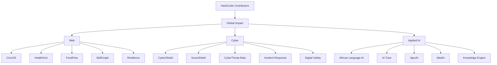
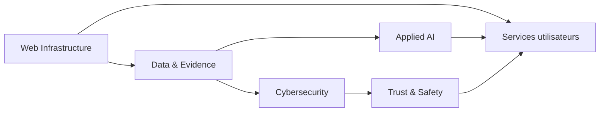

# Cartographie des projets HashCode

Cette carte relie les projets d'impact, les domaines HashCode et le programme Contributor.

## Dépendances conceptuelles

## Principe d'exécution

Chaque projet suit le même modèle :

1. Identifier un problème réel.
2. Documenter les utilisateurs et le contexte.
3. Vérifier les hypothèses avec des personnes concernées.
4. Construire le plus petit prototype utile.
5. Tester sur le terrain.
6. Mesurer l'impact et les effets indésirables.
7. Documenter ce qui fonctionne et ce qui échoue.
8. Publier, maintenir ou arrêter sur la base des résultats.

## Relations avec les missions

Les issues et missions du programme Contributor doivent pointer vers un dépôt projet lorsqu'elles demandent une contribution technique ou métier. Les missions transversales restent dans `hashcode-contributors`.

## Liens

- Programme Contributor : https://github.com/HashCode-Reboot/hashcode-contributors
- Catalogue Global Impact : [projets-impact-global.md](projets-impact-global.md)
