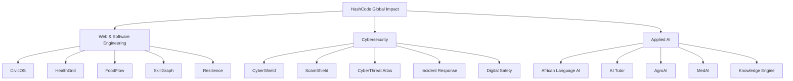
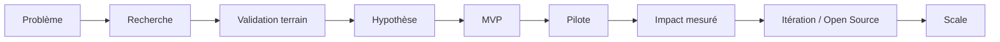

# HashCode Global Impact Program

Ce document est le catalogue central des projets à impact de HashCode. Chaque projet possède son propre dépôt et peut accueillir des missions Contributor.

## Doctrine

> **Build for Africa. Scale for Humanity.**

Un projet n'est pas lancé parce qu'une technologie est populaire. Il part d'un problème réel, d'une hypothèse testable et d'un besoin de terrain.

## Cartographie globale

## 15 projets

### Web & Software Engineering

| Projet | Dépôt | Problème exploré |
|---|---|---|
| CivicOS | https://github.com/HashCode-Reboot/hashcode-civicos | Services publics numériques |
| HealthGrid | https://github.com/HashCode-Reboot/hashcode-healthgrid | Coordination des soins |
| FoodFlow | https://github.com/HashCode-Reboot/hashcode-foodflow | Pertes alimentaires et logistique |
| SkillGraph | https://github.com/HashCode-Reboot/hashcode-skillgraph | Compétences, preuves et opportunités |
| Resilience | https://github.com/HashCode-Reboot/hashcode-resilience | Risques et alertes de catastrophe |

### Cybersecurity

| Projet | Dépôt | Problème exploré |
|---|---|---|
| CyberShield | https://github.com/HashCode-Reboot/hashcode-cybershield | Sécurité accessible aux organisations |
| ScamShield | https://github.com/HashCode-Reboot/hashcode-scamshield | Fraudes et arnaques numériques |
| CyberThreat Atlas | https://github.com/HashCode-Reboot/hashcode-cyberthreat-atlas | Renseignement sur les menaces |
| Incident Response | https://github.com/HashCode-Reboot/hashcode-incident-response | Réponse structurée aux incidents |
| Digital Safety | https://github.com/HashCode-Reboot/hashcode-digital-safety | Protection des utilisateurs |

### Applied AI

| Projet | Dépôt | Problème exploré |
|---|---|---|
| African Language AI | https://github.com/HashCode-Reboot/hashcode-african-language-ai | Sous-représentation des langues africaines |
| AI Tutor | https://github.com/HashCode-Reboot/hashcode-ai-tutor | Accompagnement pédagogique adaptatif |
| AgroAI | https://github.com/HashCode-Reboot/hashcode-agroai | Aide agricole contextualisée |
| MedAI | https://github.com/HashCode-Reboot/hashcode-medai | Assistance documentaire et coordination médicale |
| Knowledge Engine | https://github.com/HashCode-Reboot/hashcode-knowledge-engine | Transformer la connaissance en hypothèses testables |

## Cycle commun

## Comment les Contributors interviennent

Les contributions peuvent concerner :

- recherche et interviews terrain ;
- cadrage produit ;
- UX/UI ;
- développement ;
- data engineering ;
- IA/ML ;
- cybersécurité ;
- documentation ;
- tests ;
- déploiement ;
- mesure d'impact ;
- partenariats et communication scientifique.

## Niveaux de mission

- **INIT** : petite contribution documentée, accessible à un nouveau contributor.
- **CORE** : contribution structurante nécessitant coordination et revue.
- **PRO** : problème complexe, expertise ou responsabilité de sous-système.

## Règle d'or

Aucune promesse d'impact ne doit être présentée comme un résultat avant mesure. Les prototypes sont des hypothèses jusqu'à validation.
