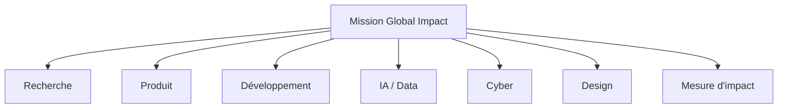

# Missions — Global Impact

Ces missions permettent aux Contributors de rejoindre les projets d'impact sans devoir commencer par coder une application complète.

## Cartographie

## Premières missions par projet

| ID | Projet | Première mission proposée |
|---|---|---|
| GI-001 | [CivicOS](https://github.com/HashCode-Reboot/hashcode-civicos) | Cartographier une démarche administrative et ses acteurs |
| GI-002 | [HealthGrid](https://github.com/HashCode-Reboot/hashcode-healthgrid) | Documenter un parcours réel de référencement médical |
| GI-003 | [FoodFlow](https://github.com/HashCode-Reboot/hashcode-foodflow) | Étudier une chaîne locale de pertes post-récolte |
| GI-004 | [SkillGraph](https://github.com/HashCode-Reboot/hashcode-skillgraph) | Définir un modèle de preuves de compétences |
| GI-005 | [Resilience](https://github.com/HashCode-Reboot/hashcode-resilience) | Identifier les sources publiques de risque d'une zone pilote |
| GI-006 | [CyberShield](https://github.com/HashCode-Reboot/hashcode-cybershield) | Définir le minimum de sécurité nécessaire à une PME |
| GI-007 | [ScamShield](https://github.com/HashCode-Reboot/hashcode-scamshield) | Classifier des scénarios de scams et leurs signaux |
| GI-008 | [CyberThreat Atlas](https://github.com/HashCode-Reboot/hashcode-cyberthreat-atlas) | Concevoir le schéma de données des indicateurs |
| GI-009 | [Incident Response](https://github.com/HashCode-Reboot/hashcode-incident-response) | Construire un playbook de triage initial |
| GI-010 | [Digital Safety](https://github.com/HashCode-Reboot/hashcode-digital-safety) | Concevoir un parcours d'aide après phishing |
| GI-011 | [African Language AI](https://github.com/HashCode-Reboot/hashcode-african-language-ai) | Étudier les sources de données linguistiques légalement utilisables |
| GI-012 | [AI Tutor](https://github.com/HashCode-Reboot/hashcode-ai-tutor) | Définir un protocole de mesure de progression pédagogique |
| GI-013 | [AgroAI](https://github.com/HashCode-Reboot/hashcode-agroai) | Documenter les besoins d'un producteur pilote |
| GI-014 | [MedAI](https://github.com/HashCode-Reboot/hashcode-medai) | Définir un benchmark de recherche documentaire médicale |
| GI-015 | [Knowledge Engine](https://github.com/HashCode-Reboot/hashcode-knowledge-engine) | Définir un protocole de provenance et citation des sources |

## Format d'une mission

Chaque mission doit préciser :

- problème et contexte ;
- bénéficiaires ;
- livrable ;
- effort estimé ;
- niveau INIT / CORE / PRO ;
- critères d'acceptation ;
- risques ;
- méthode de validation ;
- métrique d'impact si applicable.

## Cycle

`Mission → Contribution → Revue → Validation → Preuve → Progression Contributor`

Pour une mission technique, ouvrir ou rejoindre l'issue correspondante du dépôt projet. Les contributions transversales restent dans `hashcode-contributors`.
